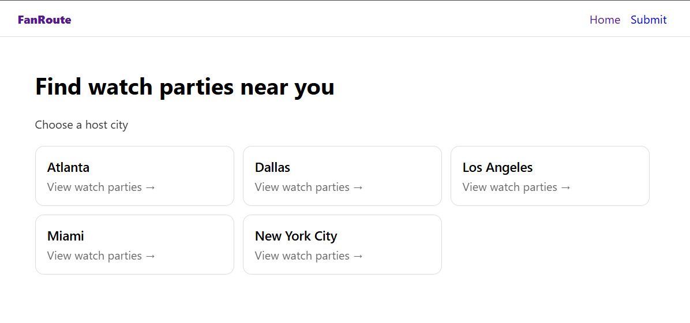
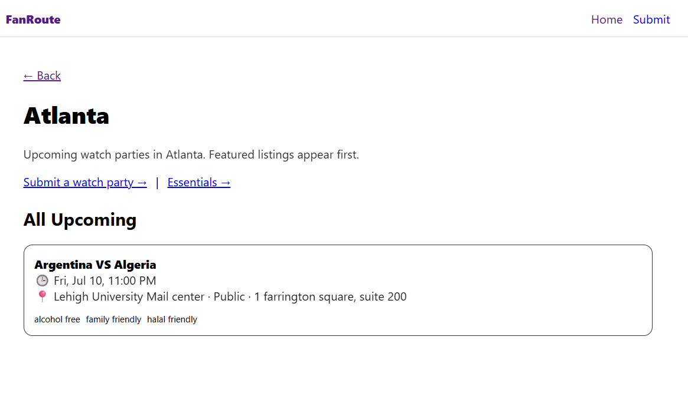
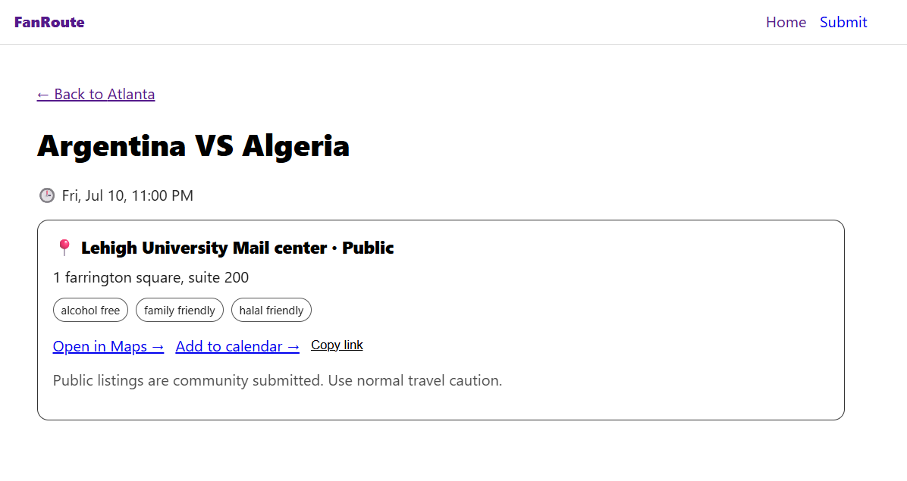

# FanRoute

FanRoute is a lightweight MVP for discovering Local World Cup watch parties and fan meetups by host city.

## Why FanRoute
FanRoute was built to solve a simple problem: during major tournaments,
fans struggle to discover reliable, Local, community-driven watch parties
without digging through scattered social posts or generic event platforms.

This MVP focuses on safety, moderation, and city-based discovery.

## Features
- Browse host cities and approved events
- Submit a watch party/meetup (pending approval)
- include the party's/meetup's features (if it's Alcohol free, halal or family friendly)
- Admin dashboard to approve/reject and feature events
- Event detail pages with share link + add-to-calendar

## Tech stack
- Next.js (App Router)
- Supabase (Postgres + API)
- Vercel deployment

## Screenshots

### Home

### City

### Event

### Essentials

